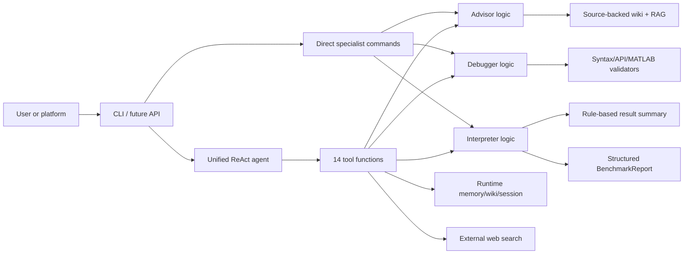
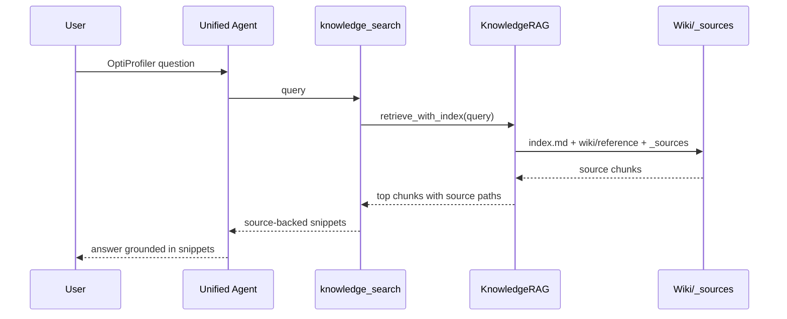
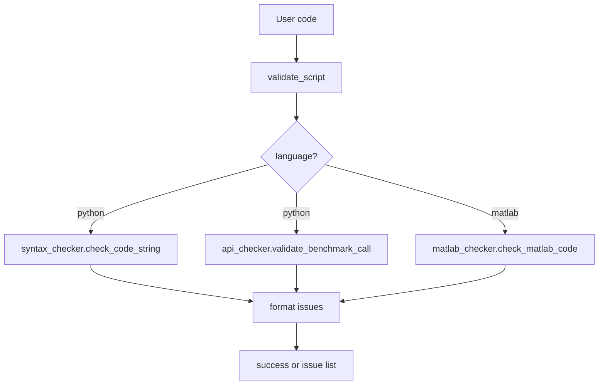
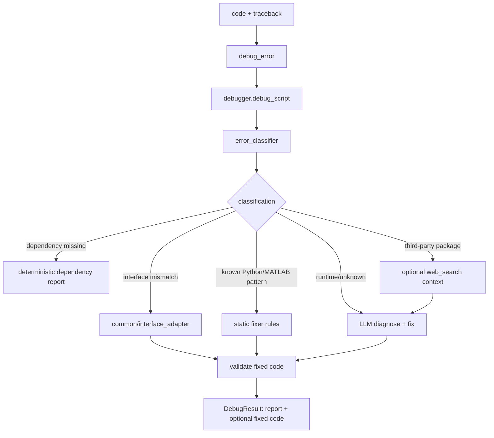
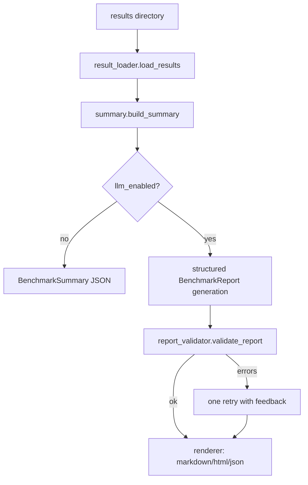
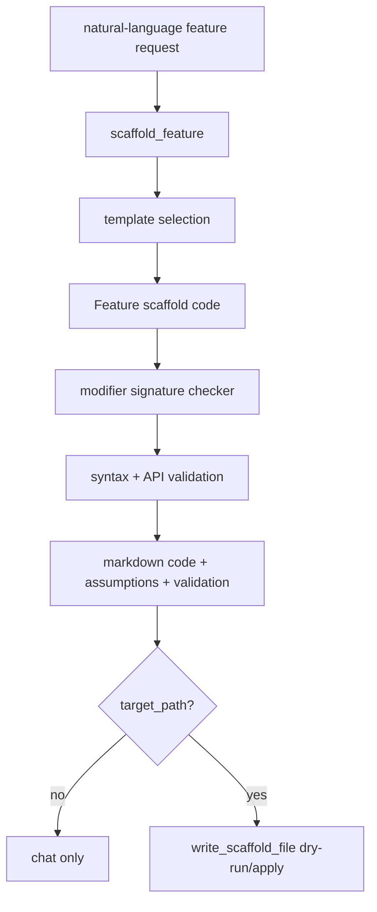
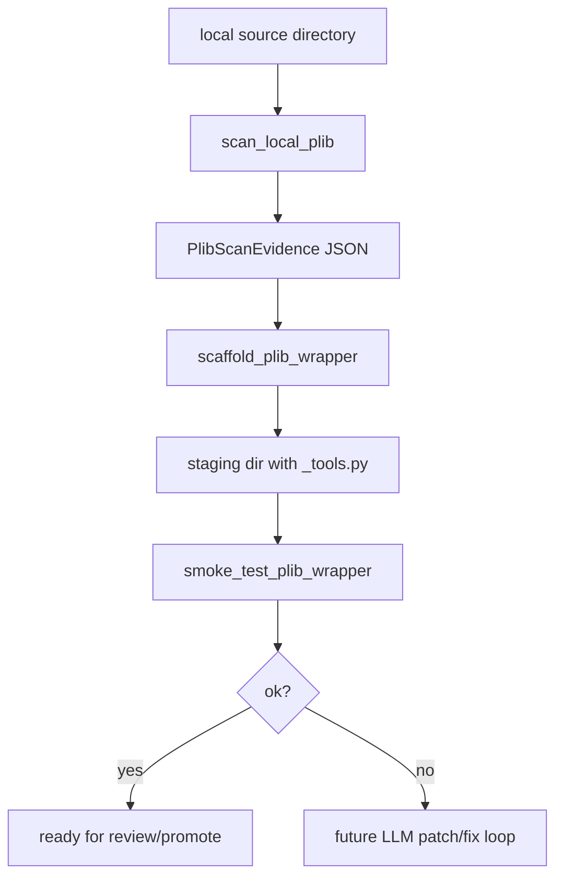

# OptiProfiler Agent Workflows

> **Audience.** Humans who need to understand what the agent does without
> reading every source file. This is the operational companion to
> [`ARCHITECTURE.md`](ARCHITECTURE.md): it follows user workflows, names the
> tools and modules involved, and explains the main logic at each step.
>
> **Rule for maintainers.** When adding, renaming, or changing a unified-agent
> tool, update this file, [`ARCHITECTURE.md`](ARCHITECTURE.md), and
> `tests/test_unified_agent.py` in the same change.

---

## 1. Mental model

OptiProfiler Agent is not one prompt. It is a small system of specialist
pipelines behind one conversational interface.

There are three specialist agents and one router:

| Layer | Main file | Job |
|---|---|---|
| Advisor | `optiprofiler_agent/advisor/advisor.py` | Answer package/platform questions and help generate OptiProfiler-shaped code. |
| Debugger | `optiprofiler_agent/debugger/debugger.py` | Diagnose failed benchmark scripts and produce suggested fixes. |
| Interpreter | `optiprofiler_agent/interpreter/interpreter.py` | Parse benchmark outputs and produce structured reports. |
| Unified Agent | `optiprofiler_agent/unified_agent.py` | ReAct router that chooses tools from all three specialists. |

The unified agent is the normal interactive surface. Direct specialist
commands exist for fixed workflows such as `opagent debug --run` or
`opagent interpret`.

---

## 2. Request router

Most user-facing traffic enters through `opagent`, implemented in
`optiprofiler_agent/cli.py`.

| User action | CLI path | Agent path |
|---|---|---|
| `opagent` or `opagent agent` | interactive unified loop | `create_unified_agent()` in `unified_agent.py` |
| `opagent chat` | Advisor-only chat | `AdvisorAgent.chat()` |
| `opagent check file.py` | no LLM by default | syntax/API validators |
| `opagent debug file.py --run` | specialist debugger | local/MATLAB runner + Debugger |
| `opagent interpret out/...` | specialist interpreter | result loader + summary + report generation |
| `opagent wiki ...` | knowledge maintenance | wiki lint/stats/index tools |
| `opagent doctor` | environment check | provider/runtime/optional dependency checks |

The unified loop also prints a tool trace in the terminal. That trace is
deliberate: it shows whether the model actually called `knowledge_search`,
`debug_error`, `web_search`, or another tool before answering.

---

## 3. Unified-agent tools

The source of truth is `_build_tools(config)` in
`optiprofiler_agent/unified_agent.py`. Each tool is a small wrapper around
specialist code.

| Tool | When it should be called | Main implementation | Side effects |
|---|---|---|---|
| `knowledge_search` | OptiProfiler API, options, examples, concepts | `common/rag.py` | Builds/reads vector index |
| `validate_script` | User asks whether code is valid | `validators/syntax_checker.py`, `validators/api_checker.py`, `validators/matlab_checker.py` | None |
| `debug_error` | User provides code plus error/traceback | `debugger/debugger.py` | None |
| `interpret_results` | User points to benchmark output | `interpreter/interpreter.py` | None |
| `remember` | User explicitly asks the agent to remember a stable fact | `runtime/memory.py` | Appends `~/.opagent/MEMORY.md` |
| `update_user_profile` | User gives stable profile information | `runtime/memory.py` | Updates `~/.opagent/USER.md` |
| `recall_past` | User refers to prior conversation | `runtime/session_log.py` | None |
| `add_wiki_page` | Verified missing local knowledge should be saved | `runtime/wiki_local.py` | Writes `~/.opagent/wiki/auto/*.md` |
| `scaffold_feature` | User wants a custom `feature_name="custom"` feature | `advisor/scaffold_feature.py`, `advisor/scaffold_file.py` | Optional file preview/write |
| `write_scaffold_file` | User asks to save generated code | `advisor/scaffold_file.py` | Writes target file when `dry_run=False` |
| `scan_local_plib` | User wants to wrap a local problem library | `advisor/plib_scanner.py` | Read-only |
| `scaffold_plib_wrapper` | Generate staged wrapper files | `advisor/plib_wrapper.py` | Writes staging directory |
| `smoke_test_plib_wrapper` | Check staged wrapper works | `advisor/plib_wrapper.py` subprocess smoke test | None |
| `web_search` | External solvers, packages, recent papers, third-party tracebacks | `tools/web_search.py` | External API call if configured |

Two routing rules are especially important:

- OptiProfiler package facts must come from `knowledge_search`, not open web
  search. This keeps the agent grounded in the source-backed wiki.
- If the user provides an error, traceback, or exception together with code,
  the unified agent must call `debug_error`; it should not answer from generic
  knowledge alone.

---

## 4. Workflow: answer a package question

Example: "What does `ptype='ubln'` mean?" or "Can I define the noisy
distribution?"

Bottom logic:

1. `knowledge_search` builds a `KnowledgeRAG` instance.
2. `KnowledgeRAG.build_index()` indexes bundled wiki pages and raw JSON
   sources when needed.
3. `retrieve_with_index()` first narrows the topic through `wiki/index.md`,
   then retrieves focused chunks.
4. Language-scoped retrieval filters out the other language's API/reference
   pages when the query is clearly Python or MATLAB.

Maintenance note: if the agent misses a package option, first check whether
the source-backed wiki audit covers it before changing prompts.

---

## 5. Workflow: validate a benchmark script

Example: "Is this script correct?"

Bottom logic:

- Python validation is static. It parses syntax and checks the public
  OptiProfiler API contract: valid `benchmark()` call shape, `ptype`, solver
  list, imports, and common hallucinated submodules.
- MATLAB validation is a safety/structure checker. It catches dangerous
  calls, shell escapes, bracket imbalance, and malformed script/function
  layout.
- This workflow does not call an LLM unless the user asks for broader advice.

---

## 6. Workflow: debug a failed submission

Example: user pastes code plus `ModuleNotFoundError`, MATLAB "Too many input
arguments", timeout, or a numerical failure.

Bottom logic:

1. The debugger normalizes language to Python or MATLAB.
2. `error_classifier` assigns a category: interface mismatch, dependency,
   timeout, numerical, runtime, etc.
3. Deterministic fixers run before LLM repair when the pattern is known.
   Examples: solver interface wrappers, simple Python bounds-shape fixes,
   MATLAB field guards, MATLAB argument-count fixes.
4. For external-library tracebacks, the debugger may add web context. Web
   snippets are marked `source=web` and treated as supporting evidence only.
5. Candidate fixes are validated before being returned.

Why this matters: the Debugger is not "ask the LLM to fix code" as a single
step. It is classifier -> deterministic path when possible -> LLM fallback ->
validator gate.

---

## 7. Workflow: interpret benchmark results

Example: user points the agent to `out/<experiment>/`.

Bottom logic:

- `result_loader` reads logs, scores, run results, problem tables, and profile
  artifacts from Python or MATLAB output directories.
- `summary.build_summary()` creates a fact object before the LLM sees
  anything. Solver names, scores, winners, failures, and anomaly evidence come
  from parsed data.
- `interpreter.interpret()` asks for a typed `BenchmarkReport`. It tries
  constrained/structured output first, then thinking-model-aware JSON
  extraction, then validation.
- The renderer deliberately omits internal fields such as raw `language` from
  the user report.

---

## 8. Workflow: generate a custom feature

Example: "Create a custom feature that adds heavy-tailed objective noise" or
"append this generated feature to `features.py`."

Bottom logic:

- `advisor/scaffold_feature.py` is deterministic. It maps common requests to
  valid `mod_fun`, `mod_x0`, `mod_bounds`, `mod_affine`, `mod_cub`, or
  `mod_ceq` templates.
- The signature checker enforces OptiProfiler's setup-time vs evaluation-time
  modifier contracts.
- `write_scaffold_file` is shared file I/O. `dry_run=True` returns a unified
  diff; `dry_run=False` writes, appends, or overwrites according to mode.

This is the first "ecosystem integrator" feature: the agent moves from
answering questions to producing validated extension code.

---

## 9. Workflow: scaffold a problem-library wrapper

Example: "Wrap this local problem-library folder for OptiProfiler."

Bottom logic:

1. `advisor/plib_scanner.py` walks the directory read-only and extracts
   evidence: languages, Python imports/symbols, table columns, data files,
   loader hints, selector hints, and pickle-risk hints.
2. `advisor/plib_wrapper.py` chooses a primary Python source file and optional
   `probinfo_<lib>.csv`.
3. It writes a staged `<lib>_tools.py` with:
   - `<lib>_load(problem_name)` to convert native objects/callables to
     `optiprofiler.Problem`;
   - `<lib>_select(options)` to reuse upstream selectors or CSV metadata.
4. `smoke_test_plib_wrapper` launches a subprocess, imports the generated
   tools, selects up to three problems, loads them, evaluates `fun(x0)`, and
   checks finite scalar output.

Current boundary: the generated files are staged only. Promotion into the
active custom problem-library tree is intentionally a follow-up step so user
source trees are not modified implicitly.

---

## 10. Workflow: memory, sessions, and local wiki

These tools support continuity, not benchmark logic.

| Tool or module | Purpose | Storage |
|---|---|---|
| `runtime/bootstrap.py` | Creates `OPAGENT_HOME` and seed files idempotently | `~/.opagent/` |
| `remember` / `runtime/memory.py` | Long-term facts explicitly saved by user | `~/.opagent/MEMORY.md` |
| `update_user_profile` | Stable whitelisted user fields | `~/.opagent/USER.md` |
| `runtime/session_log.py` | Chat turn log and full-text recall | `~/.opagent/sessions.db` |
| `add_wiki_page` / `runtime/wiki_local.py` | Local user/agent wiki additions | `~/.opagent/wiki/auto/` |
| `runtime/trajectory.py` | Optional trajectory JSONL for eval/debug review | local JSONL when enabled |

Design rule: persistent writes are explicit. The agent may read runtime
context at startup, but it should not silently mutate memory or user files
without a tool call whose name describes the side effect.

---

## 11. External web search

`web_search` exists for open-world information that the source-backed
OptiProfiler wiki cannot contain:

- third-party solver/library issues;
- recent papers;
- external installation notes;
- tracebacks from packages such as SciPy, PRIMA, pycutest, or NLopt.

It is not the source of truth for OptiProfiler API behavior. For package
options, examples, feature semantics, and import paths, use `knowledge_search`.

The debugger also has a narrow web-search path for external tracebacks. That
path is intentionally fail-soft: missing Tavily configuration, empty results,
or provider errors should not break local debugging.

---

## 12. Evaluation map

The test/eval suite mirrors the architecture.

| Layer | What is checked | Main files |
|---|---|---|
| Tool registration | unified tool list and smoke behavior | `tests/test_unified_agent.py` |
| Knowledge coverage | wiki lint, source-backed coverage, RAG visibility | `tests/test_wiki_coverage_audit.py`, `tests/test_knowledge_base.py`, `tests/test_rag.py` |
| Advisor generation | custom feature and problem-library scaffolding | `tests/test_scaffold_feature.py`, `tests/test_plib_*`, `tests/eval_cases/advisor_*.json` |
| Debugger | deterministic fixes, broken-script Pass@1 gates | `tests/test_debugger*.py`, `scripts/run_debugger_eval.py` |
| Interpreter | summary parsing, report schema, fact validation | `tests/test_interpreter*.py`, `scripts/run_interpreter_eval.py` |
| Multi-node workflow | no-LLM node-level regression over A/B/C | `scripts/run_multinode_eval.py`, `tests/test_deterministic_agent_eval.py` |
| Release CI | lint, prose, core tests, RAG, dry-run eval | `.github/workflows/ci.yml` |

For scoring philosophy and release thresholds, read
[`EVALUATION.md`](EVALUATION.md).

---

## 13. How to trace a new feature

When you need to understand or modify one capability, follow this path:

1. Start at the user surface in `optiprofiler_agent/cli.py` or the relevant
   unified tool in `optiprofiler_agent/unified_agent.py`.
2. Jump to the specialist module named in the tool wrapper.
3. Check validators and runtime writes. Ask: does this path read only, write a
   staged file, or mutate user/runtime state?
4. Find the matching tests and eval cases.
5. Update this workflow document if the visible chain changed.

This keeps the codebase understandable as the agent grows from package expert
to platform copilot and eventually to a loop-engineering layer for data,
solver, and benchmarking-tool onboarding.
