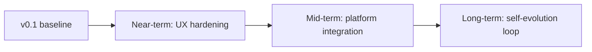

# OptiProfiler Agent — Roadmap

> **Scope**: forward-looking work that we have not yet shipped, organised
> by impact horizon. Past work is recorded in [`TASKS.md`](TASKS.md);
> design docs for already-implemented subsystems live in
> [`HERMES_INSPIRED.md`](HERMES_INSPIRED.md) and
> [`llm-wiki-design.md`](llm-wiki-design.md). This file is the single
> authoritative source of "what's next".



The horizons map to roughly **<1 month**, **1-3 months**, and
**3-12 months** of focused effort. Items are intentionally framed as
"problem to solve" rather than "feature to ship" so we avoid scope
creep.

---

## Near-term — UX hardening (≤ 1 month)

### N1. L4 constrained decoding for `BenchmarkReport`

**Problem.** Thinking models (MiniMax-M2, DeepSeek-R1, Kimi-thinking)
emit `<think>...</think>` reasoning blocks that LangChain's
`with_structured_output` cannot parse, forcing the interpreter into a
manual JSON-extraction fallback (see
[`interpreter/interpreter.py`](../optiprofiler_agent/interpreter/interpreter.py)
`_try_manual_json`). When the model's JSON itself is malformed, we
silently degrade to a free-form Markdown report.

**Approach.** Replace `_try_structured_output` with a constrained-decoding
backend that masks the model's logits during sampling, so only tokens
extending a valid `BenchmarkReport` JSON path can be emitted. Concretely:

- Wrap [`outlines`](https://github.com/dottxt-ai/outlines) or
  [`xgrammar`](https://github.com/mlc-ai/xgrammar) behind the existing
  `CodeConstraintBackend` Protocol (already declared in
  [`HERMES_INSPIRED.md`](HERMES_INSPIRED.md) §7.6).
- Convert `BenchmarkReport` Pydantic schema to a JSON-schema string
  (`BenchmarkReport.model_json_schema()`) and pass it to the backend.
- Gate behind a runtime flag (`config.llm.constrained_decoding=True`) so
  this only kicks in for self-hosted vLLM deployments. API-only
  providers (OpenAI / MiniMax / Kimi) keep the manual-JSON fallback.

**Why report-schema first, not Python imports.** Reports are a closed,
finite grammar; Python is Turing-complete. A grammar-masking decoder
catches the *easy* L4 win (~100 lines of JSON) without claiming false
guarantees about arbitrary code generation.

**Success metric.** Manual-JSON fallback rate drops from current ~35 %
on thinking models to <1 %. Free-form fallback can then be deleted.

### N2. `web_search` in the debugger path

**Problem.** [`debugger/debugger.py`](../optiprofiler_agent/debugger/debugger.py)
classifies tracebacks but only consults `knowledge_search` (our own
wiki) and the LLM's parametric memory. Errors raised by third-party
packages (`scipy`, `pycutest`, `prima`'s C wrapper) are best resolved
by searching their issue trackers — exactly the niche where Tavily
shines.

**Approach.** Pass the (sanitised) traceback's last frame + exception
class as a search query to `tools/web_search.py`, then feed the top
3 snippets back into the L2 lint loop. Already feasible — just needs
plumbing.

**Constraint.** Tag retrieved snippets with `source=web` in the
debugger's diagnostic report so users can audit provenance.

### N3. `opagent doctor` — single-command self-check

**Problem.** Diagnosing "why does `opagent` hang / fail silently" today
requires checking: provider env var present, network reach to LLM
endpoint, `~/.opagent/` integrity, RAG index built, optional extras
installed (`[rag]`, `[interpret]`, `[web]`).

**Approach.** Add `opagent doctor` that runs each check, prints a
green/yellow/red table (rich), and exits non-zero on any red. Mirrors
`gh status` / `aider --check`. No new external deps.

### N4a. Tighten `opagent check` AST validators

**Problem.** The static checker (`validators/api_checker.py`) accepts
clearly-broken inputs without warnings, e.g. `benchmark("cobyla", ptype="z")`
returns `is_clean=True` even though `ptype` must be one of `u/b/l/n` and
the first arg must be a list of ≥ 2 solver names. Users testing the
documented `opagent check` flow on a bad script see a misleading
`✓ looks good!` message.

**Approach.** Extend `validate_benchmark_call` to:

- enum-check `ptype` against `{"u", "b", "l", "n"}` with `severity=error`
- enforce that the solvers argument is a non-empty list literal
- warn (not error) when `n_runs` is `<= 1` or solvers contains duplicates
- add fixtures + golden assertions in `tests/test_validators.py`

**Success metric.** A representative "bad-script" suite (≥ 5 cases) is
flagged before any LLM call, eliminating the `looks good!` false
positive that prompted this entry.

### N4. `prompt_toolkit` history + tab completion

**Problem.** The chat input loop in
[`common/input_loop.py`](../optiprofiler_agent/common/input_loop.py)
already uses `prompt_toolkit` for non-deletable prompts but does not
persist history across sessions or autocomplete slash commands.

**Approach.** Add `FileHistory(~/.opagent/history)` and a
`WordCompleter` for `/help /chat /agent /debug /interpret /quit` etc.
Maybe 30 LoC.

---

## Mid-term — platform integration (1-3 months)

### M1. FastAPI online chat endpoint

**Problem.** Today the agent only ships as a CLI. The OptiProfiler website
needs an embeddable chat widget for users who don't `pip install`.

**Approach.**
- `POST /api/chat` — streams assistant reply (server-sent events).
- Multi-turn context stored in Redis with a 24h TTL, keyed by GitHub
  OAuth subject.
- Per-user rate limiting: token bucket on input tokens, hard ceiling at
  $0.50 / day default, raisable per user.
- All state writes flow through `runtime/session_log.py` so cross-session
  recall works the same way as the CLI.

**Deps.** FastAPI, Redis, GitHub OAuth (already on the wishlist for
the platform team).

### M2. Sandbox callback — auto-debug + auto-interpret

**Problem.** Sandbox tasks today fail or succeed silently from the
agent's perspective. The two most valuable agent invocations are
exactly at those two boundaries.

**Approach.**
- On task failure: sandbox POSTs `{script, traceback, exit_code}` to
  `/api/debug` → debugger returns a structured diagnostic + suggested
  fix. Frontend renders next to the failure log.
- On task success: sandbox POSTs `{results_dir_uri}` to `/api/interpret`
  → interpreter returns a `BenchmarkReport` (rendered server-side via
  `renderer.render_html`, embedded in the results page).

### M3. Session-aware follow-up questions

**Problem.** "Why does solver A degrade on n>50?" should be answerable
*after* the user reads the report, without re-uploading the results dir.

**Approach.** Cache the last `BenchmarkReport` JSON per session. When
the user asks a follow-up containing solver / problem / metric tokens,
the unified agent gets a tool that fetches the cached report instead
of re-parsing PDFs. Aligns with M1's session storage.

---

## Long-term — self-evolution loop (3-12 months)

> **Trust boundary.** Everything below is **dev / power-user only** and
> requires explicit opt-in via `~/.opagent/config.yaml` (`telemetry.enabled:
> true`) on the CLI side, or a checked checkbox at sign-up on the platform
> side. This continues the user-vs-developer split established in
> [`HERMES_INSPIRED.md`](HERMES_INSPIRED.md). PII scrubbing happens
> *before* upload; users can purge their remote history at any time
> with `opagent privacy purge --remote`.

### L1. Online interaction harvesting

**Problem.** We ship `runtime/trajectory.py` (ShareGPT JSONL dump) but
it stays on the user's disk. To improve future model fine-tunes and
to grow the troubleshooting wiki, we want the same five-tuple from
real usage:

```
(user_question, submitted_script, traceback, agent_reply, debug_trajectory, final_report)
```

**Approach.**
- Reuse the existing `trajectory.append` hook — when remote upload is
  enabled, also POST each turn to a presigned S3 URL (per-user prefix).
- Server-side de-dup + PII pass (regex over emails, IPs, paths, names
  pulled from `USER.md`) before the record reaches the durable bucket.
- Schema-versioned (`trajectory_schema: 1`) so format changes don't
  invalidate older corpora.

### L2. SFT / DPO dataset auto-derivation

**Problem.** Trajectory JSONL is close to ShareGPT but not identical:
no preference pairs, no reward labels.

**Approach.**
- Nightly batch job converts the previous day's L1 trajectories into:
  - **SFT corpus** — all assistant turns where the next user turn does
    not contain "no, that's wrong" / sentiment is non-negative.
  - **DPO pairs** — when the user explicitly retried (`/regenerate`)
    or rejected an answer, pair (rejected, accepted) with the final
    accepted version as preferred.
- Output: HuggingFace-datasets-compatible parquet under
  `s3://opagent-corpora/{date}/`.

### L3. Wiki self-update (agent writes for the next agent)

**Problem.** Real tracebacks from L1 are exactly the troubleshooting
content our static
[`knowledge/wiki/troubleshooting/`](../optiprofiler_agent/knowledge/wiki/troubleshooting/)
lacks. Today the agent can write to the *user-local* wiki (`wiki/auto/`,
see [`HERMES_INSPIRED.md`](HERMES_INSPIRED.md) §5) but not back to the
shipped knowledge base.

**Approach.**
- Cluster L1 tracebacks by exception class + first traceback frame.
- Clusters above N=10 occurrences with no existing wiki coverage get
  auto-drafted into a candidate wiki page (LLM-generated, human-reviewed
  via PR before merging).
- Closes the loop: real users → trajectories → cluster → wiki → next
  agent answers correctly without LLM speculation.

### L4. PyPI publish + version cadence

**Problem.** Currently install-from-source only.

**Approach.** Tag `v0.1.0`, build via `python -m build`, twine-upload.
Adopt CalVer (`YY.MM.PATCH`) once we hit monthly cadence; stick with
SemVer (`0.x.y`) until the API surface stabilises. Automate via the
existing `.github/workflows/ci.yml` plus a new `release.yml` triggered
on `v*` tags.

### L5. MATLAB script generation

**Problem.** [`advisor/`](../optiprofiler_agent/advisor/) currently
generates Python only; MATLAB users get knowledge answers but no
ready-to-run script. The `knowledge/wiki/api/matlab/` pages already
contain the necessary signatures.

**Approach.** Gate via `--language matlab`. Reuse the same prompt
chain but swap in MATLAB few-shots and run the result through a
MATLAB AST validator (port of `validators/syntax_checker.py`).

---

## Developer-facing follow-up (not a user feature)

These are workflow improvements for contributors. They do **not** belong
in the user-facing `README.md`; when implemented they should live in a
new `docs/CONTRIBUTING.md` and/or be wired into `Makefile` targets.

### D1. Extend `scripts/run_eval.py` to cover all three agents

**Problem.** Today `scripts/run_eval.py` only exercises `advisor` and
`unified` modes. Recent renames (`advisor` / `debugger` / `interpreter`)
made this gap more visible: prompt or routing changes in `debugger/` or
`interpreter/` ship with **no automated regression signal** beyond unit
tests.

**Approach.**

- Add `--agent {advisor,debugger,interpreter,unified,all}` mode.
- Two new datasets:
  `eval/datasets/debugger_cases.json` (broken scripts + expected fix
  classes) and `eval/datasets/interpreter_cases.json` (canned summary
  JSON + expected report claims).
- One report row per (agent, case, provider) so we can A/B providers.

### D2. `Makefile` + `make verify` for the contributor loop

`make test` (pytest) and `make eval` (run_eval.py against a small
canary set) so a contributor's pre-PR loop is one command. Belongs in
`docs/CONTRIBUTING.md`, not the user README.

### D3. Release-only CI for the full eval

Only run the full benchmark on `release/*` branches or tags — keeps PR
CI cheap while still gating user-visible releases on quality regressions.

---

## Triage rules

When new ideas arrive:

- **Near** if it removes a current friction point with a known fix.
- **Mid** if it requires a new external integration (network endpoint,
  OAuth, sandbox).
- **Long** if it changes data flow at the trust boundary (uploads, model
  training, write-back to shipped knowledge).

Anything that fits none of the above goes in
[`TASKS.md`](TASKS.md) "Long-term Iterations" first; promote here once
we've sized it.
