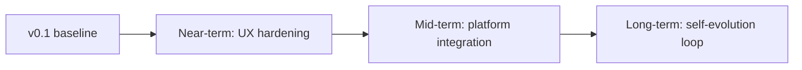

# OptiProfiler Agent — Roadmap

> **Scope**: forward-looking work that we have not yet shipped, organised
> by impact horizon. Past work is recorded in [`TASKS.md`](TASKS.md);
> design docs for already-implemented subsystems live in
> [`HERMES_INSPIRED.md`](HERMES_INSPIRED.md) and
> [`llm-wiki-design.md`](llm-wiki-design.md). This file is the single
> authoritative source of "what's next".


```mermaid
flowchart LR
    Now[v0.1 baseline] --> Near[Near-term: UX hardening]
    Near --> Mid[Mid-term: platform integration]
    Mid --> Long[Long-term: self-evolution loop]
```

The horizons map to roughly **<1 month**, **1-3 months**, and
**3-12 months** of focused effort. Items are intentionally framed as
"problem to solve" rather than "feature to ship" so we avoid scope
creep.

---

## Near-term — UX hardening (≤ 1 month)

### N1. L4 constrained decoding for `BenchmarkReport`

**Status:** First opt-in vLLM JSON Schema path implemented (2026-05).
`opagent interpret --constrained-decoding` routes a self-hosted
OpenAI-compatible vLLM endpoint through decode-time
`structured_outputs.json` constraints before the provider/manual JSON
fallback chain. The remaining success metric still needs measurement on
thinking models served by vLLM.

**Problem.** Thinking models (MiniMax-M2, DeepSeek-R1, Kimi-thinking)
emit `<think>...</think>` reasoning blocks that LangChain's
`with_structured_output` cannot parse, forcing the interpreter into a
manual JSON-extraction fallback (see
[`interpreter/interpreter.py`](../optiprofiler_agent/interpreter/interpreter.py)
`_try_manual_json`). When the model's JSON itself is malformed, we
silently degrade to a free-form Markdown report.

**Approach.** Put a constrained-decoding backend before
`_try_structured_output` that masks the model's logits during sampling,
so only tokens extending a valid `BenchmarkReport` JSON path can be
emitted. Concretely:

- Use vLLM's OpenAI-compatible JSON-schema structured-output request
  surface (backed by its guided decoding stack) through the interpreter's
  report constraint backend.
- Convert `BenchmarkReport` Pydantic schema to a JSON-schema string
  (`BenchmarkReport.model_json_schema()`) and pass it to the backend.
- Gate behind a runtime flag (`config.llm.constrained_decoding=True`) so
  this only kicks in for self-hosted vLLM deployments. API-only
  providers (OpenAI / MiniMax / Kimi / DeepSeek / MiMo) keep the manual-JSON fallback.

**Why report-schema first, not Python imports.** Reports are a closed,
finite grammar; Python is Turing-complete. A grammar-masking decoder
catches the *easy* L4 win (~100 lines of JSON) without claiming false
guarantees about arbitrary code generation.

**Success metric.** Manual-JSON fallback rate drops from current ~35 %
on thinking models to <1 %. Free-form fallback can then be deleted.

### N2. `web_search` in the debugger path

**Problem.** [`debugger/debugger.py`](../optiprofiler_agent/debugger/debugger.py)
classifies tracebacks but only consults `knowledge_search` (our own
wiki) and the LLM's parametric memory. Errors raised by third-party
packages (`scipy`, `pycutest`, `prima`'s C wrapper) are best resolved
by searching their issue trackers — exactly the niche where Tavily
shines.

**Approach.** Pass the (sanitised) traceback's last frame + exception
class as a search query to `tools/web_search.py`, then feed the top
3 snippets back into the L2 lint loop. Already feasible — just needs
plumbing.

**Constraint.** Tag retrieved snippets with `source=web` in the
debugger's diagnostic report so users can audit provenance.

### N3. `opagent doctor` — single-command self-check

**Problem.** Diagnosing "why does `opagent` hang / fail silently" today
requires checking: provider env var present, network reach to LLM
endpoint, `~/.opagent/` integrity, RAG index built, optional extras
installed (`[rag]`, `[anthropic]`, `[web]`).

**Approach.** Add `opagent doctor` that runs each check, prints a
green/yellow/red table (rich), and exits non-zero on any red. Mirrors
`gh status` / `aider --check`. No new external deps.

### N4a. Tighten `opagent check` AST validators

**Problem.** The static checker (`validators/api_checker.py`) accepts
clearly-broken inputs without warnings, e.g. `benchmark("cobyla", ptype="z")`
returns `is_clean=True` even though `ptype` must be one of `u/b/l/n` and
the first arg must be a list of ≥ 2 solver names. Users testing the
documented `opagent check` flow on a bad script see a misleading
`✓ looks good!` message.

**Approach.** Extend `validate_benchmark_call` to:

- enum-check `ptype` against `{"u", "b", "l", "n"}` with `severity=error`
- enforce that the solvers argument is a non-empty list literal
- warn (not error) when `n_runs` is `<= 1` or solvers contains duplicates
- add fixtures + golden assertions in `tests/test_validators.py`

**Success metric.** A representative "bad-script" suite (≥ 5 cases) is
flagged before any LLM call, eliminating the `looks good!` false
positive that prompted this entry.

### N4b. In-session `/model` and `/provider` switch

**Problem.** Today `--provider` / `--model` are only honored at process
launch (`opagent --provider kimi --model kimi-k2.5`). When a user hits
mid-conversation friction — provider 529 overloaded errors, a model that
keeps hallucinating, a Claude-only tool they want to try — the only
escape hatch is to `/quit`, restart with new flags, and lose the chat
context. This is exactly the moment they *most* want a one-keystroke
switch.

**Approach.**

- Add `/model` and `/provider` slash commands in both the unified-agent
  and advisor loops (`cli.py` `agent()` / `chat()`).
- `/model` with **no argument**: print a small table of *currently
  reachable* options:
  - all built-in providers whose `env_key` resolves (so we never list a
    provider the user has no key for),
  - their configured / default model (`OPAGENT_DEFAULT_MODEL` overrides
    plus the registry default),
  - and the active one marked with `*`.
  Reuse `onboarding.detect_configured_providers()` so the listing
  matches what `opagent init` already shows.
- `/model <name>` or `/provider <name> [model]`: rebuild `LLMConfig`,
  call `create_llm`, then re-bind the underlying agent
  (`create_unified_agent` / `AdvisorAgent`) **without clearing
  `messages`** so the conversation history survives the swap.
- Fail soft: if the requested provider has no key reachable, print the
  same hint we use elsewhere ("set `KIMI_API_KEY=...` or run `opagent
  init`") instead of crashing the loop.

**Why now.** The user-reported 529 from MiniMax (`overloaded_error`,
2026-04 logs) had no in-session workaround other than restarting the
CLI. With multiple keys configured this is purely a UX gap, not a new
capability.

**Success metric.** Switching between any two configured providers
mid-chat preserves both message history and the prompt-toolkit input
session; covered by a `tests/test_cli_slash_commands.py` integration
test that drives `/model kimi` after a turn and asserts the next
`invoke()` reaches the new client.

### N4. `prompt_toolkit` history + tab completion

**Problem.** The chat input loop in
[`common/input_loop.py`](../optiprofiler_agent/common/input_loop.py)
already uses `prompt_toolkit` for non-deletable prompts but does not
persist history across sessions or autocomplete slash commands.

**Approach.** Add `FileHistory(~/.opagent/history)` and a
`WordCompleter` for `/help /chat /agent /debug /interpret /quit` etc.
Maybe 30 LoC.

### N5. MATLAB support for Agent B and C (driven by optiprofiler-platform)

**Status:** Implemented (2026-05). See [`docs/PLATFORM_INTEGRATION.md`](PLATFORM_INTEGRATION.md).

**Problem.** The platform's multi-language sandbox runs MATLAB solvers,
but Agent B assumed Python-only tracebacks and Agent C's LLM prompts could
suggest `pip install` for MATLAB failures. Platform Phase 2 auto-debug
and interpret integration were blocked without language-aware plumbing.

**What shipped:**

| Component | Change |
|---|---|
| **Agent B** | `debug_script(..., language="python"\|"matlab")`; MATLAB error regex; MATLAB system/fix prompts; `matlab_checker.py`; MATLAB code-block extraction |
| **Agent C** | Existing `result_loader` MATLAB prefixes confirmed; `profile_curves_available` flag + report notice when PDF curves can't be parsed; language-aware LLM prompt |
| **Shared** | `interface_adapter.py` MATLAB signature analysis + wrapper generation |
| **CLI / tools** | `opagent debug/check -l matlab`; unified-agent `validate_script`, `debug_error`, `interpret_results(report_language=...)` |

**Phase 5 follow-up (2026-05, done after the platform work above):**

- `debugger/matlab_runner.py` — real `matlab -batch` sandbox runner with timeout, kill-tree on timeout, and `getReport`-style traceback extraction. `run_and_debug` dispatches by language via `_run_code_for_language` (returns a synthetic `RunResult` when MATLAB isn't installed, so the loop still produces a static diagnostic).
- `pytest` marker `requires_matlab` auto-skips MATLAB-only suites when `MATOP_MATLAB_BIN` / `matlab` is missing.
- Fifteen curated broken `.m` fixtures (`tests/fixtures/broken_matlab/`) with golden fixes; `scripts/run_debugger_eval.py` computes Pass@1 (golden and LLM strategies). Latest MiniMax LLM artifact is 15/15 in `docs/eval/debugger_matlab_minimax_llm.md`, and the pytest gate (`tests/test_debugger_eval_matlab.py`) enforces ≥70%.
- `tests/test_interpreter_eval_matlab.py` checks that Agent C's no-LLM and mocked-LLM paths still mention the ground-truth winner / runner-up on a real MATLAB experiment.

**Deferred (tracked in [`TASKS.md`](TASKS.md)):**

- B-10 multi-file debug (`auxiliary_files`) — waits for platform ZIP upload
- Medium-term MATLAB PDF vector-path parser (full curve extraction)
- Run `--strategy llm` end-to-end across providers beyond MiniMax; persist per-provider Pass@1 artifacts.
- L4 — expand provider/Judge release samples beyond the current MiniMax accepted artifact.

---

## Mid-term — platform integration (1-3 months)

### M1. FastAPI online chat endpoint

**Problem.** Today the agent only ships as a CLI. The OptiProfiler website
needs an embeddable chat widget for users who don't `pip install`.

**Approach.**
- `POST /api/chat` — streams assistant reply (server-sent events).
- Multi-turn context stored in Redis with a 24h TTL, keyed by GitHub
  OAuth subject.
- Per-user rate limiting: token bucket on input tokens, hard ceiling at
  $0.50 / day default, raisable per user.
- All state writes flow through `runtime/session_log.py` so cross-session
  recall works the same way as the CLI.

**Deps.** FastAPI, Redis, GitHub OAuth (already on the wishlist for
the platform team).

### M2. Sandbox callback — auto-debug + auto-interpret

**Problem.** Sandbox tasks today fail or succeed silently from the
agent's perspective. The two most valuable agent invocations are
exactly at those two boundaries.

**Approach.**
- On task failure: sandbox POSTs `{script, traceback, exit_code}` to
  `/api/debug` → debugger returns a structured diagnostic + suggested
  fix. Frontend renders next to the failure log.
- On task success: sandbox POSTs `{results_dir_uri}` to `/api/interpret`
  → interpreter returns a `BenchmarkReport` (rendered server-side via
  `renderer.render_html`, embedded in the results page).

### M3. Session-aware follow-up questions

**Problem.** "Why does solver A degrade on n>50?" should be answerable
*after* the user reads the report, without re-uploading the results dir.

**Approach.** Cache the last `BenchmarkReport` JSON per session. When
the user asks a follow-up containing solver / problem / metric tokens,
the unified agent gets a tool that fetches the cached report instead
of re-parsing PDFs. Aligns with M1's session storage.

### M4. Scaffold Agent — auto-generate OptiProfiler-shaped code

**Theme.** The two highest-friction "I want to plug my own thing into
OptiProfiler" tasks are (a) writing a *custom feature* and (b) writing
a *custom problem-library wrapper*. Both are template-heavy, contract-
heavy, error-prone work that the agent already has the wiki + linting
infrastructure to automate. We bundle them under one milestone because
they share the same generation + AST validation + lint-loop machinery
introduced in v0.1, and they together close the "OptiProfiler
extension" story for users.

The two sub-features have **different interaction shapes** on purpose:

- **M4a (custom feature)** is **chat-first**. Users describe what they
  want to perturb in natural language; the agent produces a finished,
  immediately-usable `Feature(...)` snippet.
- **M4b (custom problem-library wrapper)** is **full-auto with local
  filesystem access**. The agent reads the user's actual project
  directory, may search the web for upstream docs, and iterates
  generate → smoke-test → fix on its own. This is the most complex
  agent in the system, but also the most directly useful: it removes
  the single hardest step in OptiProfiler onboarding.

---

#### M4a. Custom feature generation (chat-first)

**Problem.** When none of the ten built-in `feature_name` presets
matches what a user wants to test, they have to read
[`guides/custom-feature.md`](../optiprofiler_agent/knowledge/wiki/guides/custom-feature.md),
remember the exact signatures of all eight `mod_*` modifiers
(`mod_x0`, `mod_affine`, `mod_bounds`, `mod_linear_ub`, `mod_linear_eq`,
`mod_fun`, `mod_cub`, `mod_ceq`), keep the
"setup-time vs every-evaluation" distinction straight, and stay inside
the `numpy.random.Generator` API. Most users either give up and
mis-use a built-in preset or write something that breaks `pickle`-based
parallelism on the first run.

**Approach.**

1. **New unified-agent tool `scaffold_feature`.** Triggered when the
   user says something like "I want a feature that adds heavy-tailed
   noise scaled by the gradient norm" or "perturb x0 inside an
   ellipsoid around the original point". The tool is *chat-first*: if
   the user's description leaves ambiguity (which `mod_*` to use, what
   `n_runs` makes sense, whether the perturbation is deterministic),
   the agent asks one focused clarification question before
   generating, then commits.

2. **Output is a complete, runnable code block.** Not a sketch:

   ```python
   import numpy as np
   from optiprofiler import Feature

   def my_mod_fun(x, rng, problem):
       ...

   feature = Feature(
       feature_name="custom",
       n_runs=10,
       mod_fun=my_mod_fun,
       distribution=...,
   )
   ```

   The snippet is validated through `validators/syntax_checker.py` +
   `validators/api_checker.py` + an **8-modifier signature checker**
   (new) before it leaves the tool. If the signature checker rejects
   it, the lint loop retries up to 2× before surfacing the failure.

3. **File-I/O capability.** The tool accepts an optional
   `target_path` argument:

   - **omitted** → return the snippet inline in chat (default).
   - **path to a new file** → write the snippet there, with shebang +
     a header comment naming the feature.
   - **path to an existing file** → *append* the feature definition
     (and any imports it needs, with import-dedup) without touching
     the rest of the file. The agent always shows the user the
     planned diff and asks for confirmation before writing.

**Knowledge base — already in place.** `custom-feature.md` gives the
exact signature table, the setup-vs-every-eval distinction, and the
`distribution` callable contract.

**Success metric.** Five canned test cases (heavy-tailed noise,
ellipsoidal `x0` perturbation, gradient-scaled noise, quantised + noisy
composite, infeasible-side constraint perturbation) each produce code
that runs without modification inside a `benchmark()` call and survives
a 2-process parallel run (i.e. pickles cleanly — see
[`guides/parallel-and-pickle.md`](../optiprofiler_agent/knowledge/wiki/concepts/parallel-and-pickle.md)).

---

#### M4b. Custom problem-library wrapper from a local project (full-auto)

**Problem.** Today, plugging a third-party / private / paper-companion
problem set into OptiProfiler is the single highest-friction step in
the entire onboarding flow. The user must:

1. Understand their own library's layout (which is usually
   undocumented — a folder full of `.py`, `.m`, `.f`, `.csv`, `.txt`,
   `README`, etc.).
2. Understand the OptiProfiler `Problem` contract.
3. Decide whether to use the "upstream selector" path or the
   "`probinfo_<lib>.csv`" path.
4. Write `<lib>_load(name)` + `<lib>_select(options)`.
5. Often also write a one-off `collect_info.py` to generate the CSV.
6. Debug all of the above against OptiProfiler's runtime, which only
   surfaces failures *inside* `benchmark()` with non-obvious tracebacks.

This is exactly the work the agent should do for the user. **And this
sub-feature is intentionally the most ambitious agent in the system**:
it needs local filesystem access, optional web access, and a real
inner generate → test → fix loop. We accept that complexity because
the user-facing value is the largest of any agent feature we have
planned.

**Approach — three-stage pipeline driven by a single user-facing
command.**

User entry point:

```bash
opagent scaffold-plib --src ~/projects/my_problems --name my_problems
# or via chat: "scaffold a plib wrapper for ~/projects/my_problems"
```

**Stage 1 — local discovery (requires explicit user opt-in to
filesystem access).**

- The agent walks `--src` and reads *any* file type it finds —
  `.py`, `.m`, `.f`, `.f90`, `.c`, `.csv`, `.json`, `.txt`,
  `README*`, `pyproject.toml`, `setup.py`, `Makefile`, docstrings,
  inline comments. No assumption that the library is Python; for
  non-Python sources the agent still reads them as evidence of
  structure / naming conventions / problem dimensions.
- Classifies the library along the axes documented in
  `custom-problem-library-python.md`:
  - **Loader shape**: function-per-problem? Class with a `name`
    parameter? Data-file driven? Upstream-package-backed (e.g.
    a thin wrapper around `pycutest`)?
  - **Native selector?** Does the upstream expose anything like
    `secup` / `find_problems` that we can reuse, or do we have to
    build `probinfo_<lib>.csv` ourselves?
  - **Field naming + sentinels**: what does the upstream use for
    objective callable, initial point, bound infinity (`±inf`,
    `±1e20`, `nan`)?
  - **Pickle-safety hazards**: closures over module-level state,
    capture of unpicklable objects (file handles, sockets,
    `pycutest` problem objects on workers — see
    `parallel-and-pickle.md`).
- Permission model:
  - The CLI command and the chat tool both require `--allow-fs <dir>`
    (or one-time confirmation in chat) before the agent can read
    anything outside `~/.opagent/`.
  - The grant is *read-only by default*. Any write goes to a staging
    directory under `~/.opagent/scaffold/<lib>/` first; promoting the
    output back into the user's project is a separate explicit step.
  - All reads + the file list are logged to
    `runtime/session_log.py` for auditability.

**Stage 2 — external evidence (web + user-supplied URLs).**

The agent should pull in *whatever* external context is genuinely
useful, not just from a fixed allow-list. We diversify sources rather
than restrict them:

1. **User-supplied URLs (highest priority).** The user can pass one
   or more `--ref <url>` flags (or paste links in chat): their own
   GitHub repo, the paper page, a personal homepage, an arXiv PDF,
   a published doc site. These are treated as **first-class evidence**
   and fetched directly via `WebFetch` regardless of whether the
   library is "well-known". This is the common case for private or
   paper-companion code — the user *knows* where the canonical
   description lives, the agent shouldn't have to guess.
2. **Recognised upstream packages (high signal).** If Stage 1 sees a
   substring match against a curated list (CUTEst, S2MPJ,
   NLPModels.jl, MatCUTEst, OptiBench, …) or a dependency declared in
   `requirements.txt` / `pyproject.toml` / `Project.toml`, the agent
   fetches that upstream's README + API page automatically.
3. **Open web search (broad).** For everything else — library name
   not recognised, no user URL, but obvious external references in
   READMEs / docstrings ("ported from XYZ benchmark suite",
   "originally published in Smith 2021") — the agent runs
   `tools/web_search.py` with a focused query built from those
   substrings.
4. **Fully private code (last resort).** If none of (1)–(3) yields
   anything, the agent proceeds with Stage 1 evidence only and notes
   the lack of external corroboration in the final `REPORT.md`.

Cross-cutting rules for any external content:

- All fetched material is tagged `source=web` with the originating
  URL per the N2 provenance rule, so the final report shows the user
  exactly which inferences came from which page.
- Web access is **opt-in** at the session level (same flag as
  filesystem access — e.g. `--allow-web`); if the user denied it,
  Stage 2 collapses to "Stage 1 only" without erroring.
- Fetched text is treated as *hints*, never as ground truth — Stage 3
  smoke tests are still what decide whether the generated wrapper
  is correct. A confidently-wrong upstream doc can't break us, only
  slow us down by one fix-loop iteration.

**Stage 3 — generate → smoke-test → fix loop.**

- Generate `<lib>_tools.py` containing `<lib>_load(name)` and
  `<lib>_select(options)`, plus (if needed) `collect_info.py`,
  using the templates in `custom-problem-library-python.md` and
  `problem-metadata.md`.
- All generated code passes through `validators/syntax_checker.py`
  and `validators/api_checker.py` first.
- **Smoke test in a sandboxed subprocess** (reuse
  `debugger/local_runner.py`):
  1. Import the generated `<lib>_tools` module.
  2. Call `<lib>_select({'mindim': 1, 'maxdim': 20})` → pick the
     first ≤ 3 problem names.
  3. For each, call `<lib>_load(name)` → assert it returns a
     `Problem`, then call `problem.fun(problem.x0)` and assert the
     return is a finite scalar.
  4. Quick `pickle.dumps(problem)` to catch parallel-mode hazards
     before they bite at `benchmark()` time.
- On any failure:
  - Capture exception class + traceback + the *exact source line that
    failed* and feed back into the LLM along with the original
    Stage 1 evidence.
  - Generate a focused patch (not a full regeneration) and retry.
  - Max **3 fix attempts**; configurable via `--max-fixes`.
  - On final failure, surface a structured diagnostic report
    (same format as the debugger): what was tried, where each
    attempt broke, the most likely root cause, the specific lines
    the user should inspect.

**Output layout (staged, not yet in user's project):**

```
~/.opagent/scaffold/<lib>/
├── <lib>_tools.py            # the generated wrapper
├── collect_info.py           # only if no upstream selector
├── probinfo_<lib>.csv        # populated by collect_info.py if run
├── REPORT.md                 # what the agent did, what it inferred,
│                             #   which decisions need user review
└── trajectory.jsonl          # full generate/test/fix loop for audit
```

A second explicit command (`opagent scaffold-plib promote <lib>`)
copies the staged tree into the user's project at the canonical
location.

**Tools added to `unified_agent.py`:**

| Tool | Stage | Purpose |
|---|---|---|
| `scan_local_plib(src_dir)` | 1 | Walk + classify files; return evidence JSON |
| `fetch_user_refs(urls)` | 2 | Fetch user-supplied reference URLs (repo / paper / docs) as first-class evidence |
| `search_plib_upstream(lib_hint)` | 2 | Web search; covers both curated upstreams and open queries built from Stage 1 substrings |
| `propose_plib_wrapper(evidence)` | 3 | Generate `<lib>_tools.py` from evidence + wiki templates |
| `smoke_test_plib(staging_dir)` | 3 | Subprocess-isolated end-to-end load + `fun(x0)` + pickle check |
| `propose_plib_patch(report, traceback)` | 3 | Focused fix given a failed smoke test |
| `write_scaffold_file(path, body, mode)` | M4a + M4b | Single shared write tool with `new`/`append`/`overwrite` modes and confirmation diff |

**Constraints / non-goals.**

- The agent **does not** install upstream packages on the user's
  behalf, even if Stage 1 detects them. It only reports the
  dependency and lets the user `pip install`.
- The agent **does not** modify the user's source library — only
  generates new files alongside it.
- MATLAB problem libraries are **out of scope for this milestone**;
  they're tracked in L5. The patterns are the same, but the validation
  loop needs a MATLAB AST checker that we haven't built yet.

**Why mid-term, not near-term (still true after the expansion).**
Stage 1's file-type-agnostic local scanning + the Stage 3
generate-test-fix loop are both meaningfully more complex than any
single tool we have today. The piece that *isn't* new is the wiki
knowledge — that's already shipped — so we're "only" building the
plumbing on top, but the plumbing is non-trivial.

**Success metric.** Three reference cases run end-to-end with no
manual editing:

1. A pure-Python toy library laid out like
   `optiprofiler/problem_libs/custom/` →
   `<lib>_tools.py` + `probinfo_<lib>.csv` regenerated in < 2 minutes.
2. A library that's a thin Python wrapper around an upstream package
   the agent recognises (e.g. `pycutest`) → uses upstream's native
   selector, no CSV path needed.
3. A library shipped as a folder of `.csv` / `.txt` data + a single
   loader function → agent infers the data schema from the files
   alone (no upstream search), writes the wrapper, and the wrapper
   passes the smoke test.

---

## Long-term — self-evolution loop (3-12 months)

> **Trust boundary.** Everything below is **dev / power-user only** and
> requires explicit opt-in via `~/.opagent/config.yaml` (`telemetry.enabled:
> true`) on the CLI side, or a checked checkbox at sign-up on the platform
> side. This continues the user-vs-developer split established in
> [`HERMES_INSPIRED.md`](HERMES_INSPIRED.md). PII scrubbing happens
> *before* upload; users can purge their remote history at any time
> with `opagent privacy purge --remote`.

### L1. Online interaction harvesting

**Problem.** We ship `runtime/trajectory.py` (ShareGPT JSONL dump) but
it stays on the user's disk. To improve future model fine-tunes and
to grow the troubleshooting wiki, we want the same five-tuple from
real usage:

```
(user_question, submitted_script, traceback, agent_reply, debug_trajectory, final_report)
```

**Approach.**
- Reuse the existing `trajectory.append` hook — when remote upload is
  enabled, also POST each turn to a presigned S3 URL (per-user prefix).
- Server-side de-dup + PII pass (regex over emails, IPs, paths, names
  pulled from `USER.md`) before the record reaches the durable bucket.
- Schema-versioned (`trajectory_schema: 1`) so format changes don't
  invalidate older corpora.

### L2. SFT / DPO dataset auto-derivation

**Problem.** Trajectory JSONL is close to ShareGPT but not identical:
no preference pairs, no reward labels.

**Approach.**
- Nightly batch job converts the previous day's L1 trajectories into:
  - **SFT corpus** — all assistant turns where the next user turn does
    not contain "no, that's wrong" / sentiment is non-negative.
  - **DPO pairs** — when the user explicitly retried (`/regenerate`)
    or rejected an answer, pair (rejected, accepted) with the final
    accepted version as preferred.
- Output: HuggingFace-datasets-compatible parquet under
  `s3://opagent-corpora/{date}/`.

### L3. Wiki self-update (agent writes for the next agent)

**Problem.** Real tracebacks from L1 are exactly the troubleshooting
content our static
[`knowledge/wiki/troubleshooting/`](../optiprofiler_agent/knowledge/wiki/troubleshooting/)
lacks. Today the agent can write to the *user-local* wiki (`wiki/auto/`,
see [`HERMES_INSPIRED.md`](HERMES_INSPIRED.md) §5) but not back to the
shipped knowledge base.

**Approach.**
- Cluster L1 tracebacks by exception class + first traceback frame.
- Clusters above N=10 occurrences with no existing wiki coverage get
  auto-drafted into a candidate wiki page (LLM-generated, human-reviewed
  via PR before merging).
- Closes the loop: real users → trajectories → cluster → wiki → next
  agent answers correctly without LLM speculation.

### L4. PyPI publish + version cadence

**Problem.** Currently install-from-source only.

**Approach.** Tag `v0.1.0`, build via `python -m build`, twine-upload.
Adopt CalVer (`YY.MM.PATCH`) once we hit monthly cadence; stick with
SemVer (`0.x.y`) until the API surface stabilises. Automate via
`.github/workflows/ci.yml`: a `v*` tag push runs the full CI suite,
then the `publish-pypi` job uploads to PyPI only if every prior job
succeeds (no separate release workflow).

### L5. MATLAB script generation

**Problem.** [`advisor/`](../optiprofiler_agent/advisor/) currently
generates Python only; MATLAB users get knowledge answers but no
ready-to-run script. The `knowledge/wiki/api/matlab/` pages already
contain the necessary signatures.

**Approach.** Gate via `--language matlab`. Reuse the same prompt
chain but swap in MATLAB few-shots and run the result through a
MATLAB AST validator (port of `validators/syntax_checker.py`).

---

## Developer-facing follow-up (not a user feature)

These are workflow improvements for contributors. They do **not** belong
in the user-facing `README.md`; when implemented they should live in a
new `docs/CONTRIBUTING.md` and/or be wired into `Makefile` targets.

### D1. Extend `scripts/run_eval.py` to cover all three agents

**Problem.** Today `scripts/run_eval.py` only exercises `advisor` and
`unified` modes. Recent renames (`advisor` / `debugger` / `interpreter`)
made this gap more visible: prompt or routing changes in `debugger/` or
`interpreter/` ship with **no automated regression signal** beyond unit
tests.

**Approach.**

- Add `--agent {advisor,debugger,interpreter,unified,all}` mode.
- Two new datasets:
  `eval/datasets/debugger_cases.json` (broken scripts + expected fix
  classes) and `eval/datasets/interpreter_cases.json` (canned summary
  JSON + expected report claims).
- One report row per (agent, case, provider) so we can A/B providers.

### D2. `Makefile` + `make verify` for the contributor loop

`make test` (pytest) and `make eval` (run_eval.py against a small
canary set) so a contributor's pre-PR loop is one command. Belongs in
`docs/CONTRIBUTING.md`, not the user README.

### D3. Release-only CI for the full eval

Only run the full benchmark on `release/*` branches or tags — keeps PR
CI cheap while still gating user-visible releases on quality regressions.

---

## Triage rules

When new ideas arrive:

- **Near** if it removes a current friction point with a known fix.
- **Mid** if it requires a new external integration (network endpoint,
  OAuth, sandbox).
- **Long** if it changes data flow at the trust boundary (uploads, model
  training, write-back to shipped knowledge).

Anything that fits none of the above goes in
[`TASKS.md`](TASKS.md) "Long-term Iterations" first; promote here once
we've sized it.
